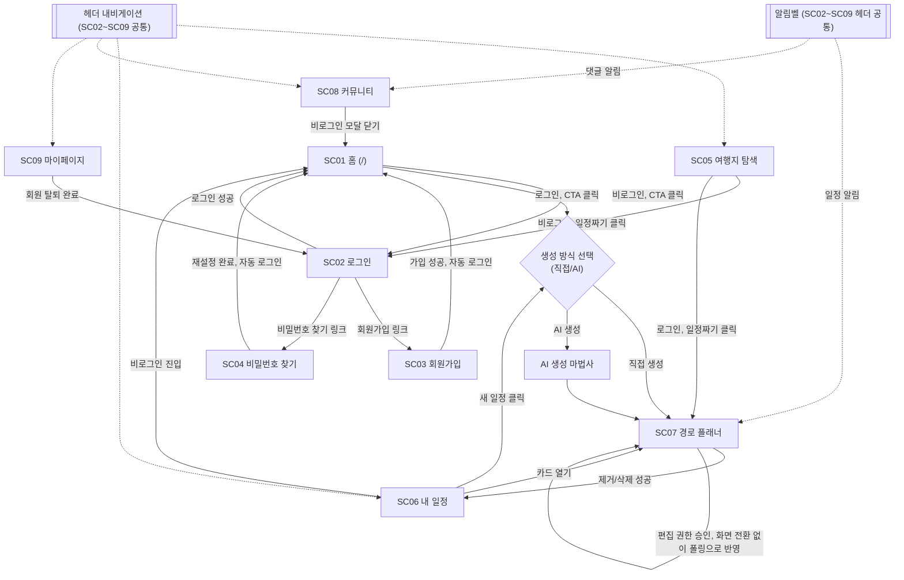

> 문서: 08-Hello-screen-flow.md · 마지막 갱신: 2026-09-18

> 참고: 이 문서의 화면 ID는 06번 문서와 같은 SC01-SC09를 쓴다. 실제 화면 이미지가 필요하면 06번 문서 맨 끝 "스크린샷 수동 확보 가이드"를 따르면 된다.

## 화면 전환 흐름

- **SC01(홈)** — 진입 조건 없음(완전 공개). CTA 클릭 시 로그인 여부를 확인해 비로그인이면 SC02로, 로그인 상태면 생성 방식 선택 모달(직접/AI)을 거쳐 SC07로 이어진다(근거: src/app/(main)/routes/NewTripFlow.tsx).
- **SC02(로그인)** — 로그인 성공 시 직전 화면(또는 홈)으로 돌아간다. "회원가입" 링크로 SC03, "비밀번호를 잊으셨나요?"로 SC04로 이동한다(근거: src/app/(auth)/login/LoginClient.tsx).
- **SC03(회원가입)** — 가입 성공 시 자동 로그인 후 SC01로 이동한다(근거: src/app/(auth)/signup/SignupClient.tsx).
- **SC04(비밀번호 찾기)** — 재설정 완료(4단계) 시 자동 로그인 후 1.2초 뒤 SC01로 이동한다(근거: src/app/(auth)/forgot-password/ForgotPasswordClient.tsx).
- **SC05(여행지 탐색)** — 진입 조건 없음(완전 공개). "이 여행지로 일정 짜기" 클릭 시 비로그인이면 곧장 SC02로, 로그인 상태면 (일수 선택 후) 준비된 AI 동선을 들고 바로 SC07(AI 모드)로 이동한다(근거: src/app/(main)/explore/ExploreClient.tsx).
- **SC06(내 일정)** — 서버 데이터 자체는 로그인 필요(비로그인 진입 시 "회원만 이용할 수 있어요" 모달이 뜨고 닫으면 SC01로 이동). "새 일정" 클릭은 SC01의 CTA와 동일한 생성 방식 선택→날짜 선택 흐름을 그대로 재사용한다(`NewTripFlow` 컴포넌트 공유). 카드 "열기"는 `/planner?loadRoute=<id>`로 SC07에 진입한다(근거: src/app/(main)/routes/MyRoutesClient.tsx).
- **SC07(경로 플래너)** — 네 가지 방식으로 진입한다: 신규 생성(`?new=1`), 기존 일정 열기(`?loadRoute=<id>`), 초대 링크(`?invite=<token>&role=...`), 여행지 탐색발 AI 핸드오프(`?mode=ai`). 초대 링크로 들어온 미참여 사용자는 로그인 여부와 무관하게 우선 읽기 전용으로 보여지며, "저장"을 눌러야 실제로 참여(뷰어 등록 또는 편집 권한 요청)한다. 편집 권한이 승인되면 화면 전환 없이 같은 SC07 안에서 뷰어→편집자로 UI가 바뀐다(5초 폴링). "내 일정에서 제거" 또는 "원본 삭제"에 성공하면 SC06으로 이동한다(근거: src/app/planner/PlannerClient.tsx).
- **SC08(커뮤니티)** — 서버는 로그인 여부와 무관하게 게시물 데이터를 내려주지만, 화면은 비로그인 시 로그인 유도 모달로 즉시 덮이고 모달을 닫으면(X, 배경 클릭 포함) SC01로 이동한다(근거: src/app/(main)/community/CommunityClient.tsx).
- **SC09(마이페이지)** — 헤더의 "로그인/마이페이지" 링크는 로그인 여부에 따라 SC02 또는 SC09로 연결되지만, 이는 헤더 링크의 편의일 뿐 화면 자체의 접근 제한이 아니다. `/my-page` URL로 직접 접속하면 로그인 여부와 무관하게 화면 전체(닫혀 있는 모달 문구 포함)가 그대로 열린다 — `MyPageClient.tsx`에 진입을 막는 분기가 없다(06번 문서 SC09 "정정 사항" 참고). 다만 닉네임 저장·아바타 변경·알림 설정·탈퇴 같은 실제 동작은 서버 API가 세션 부재를 이유로 거부한다. 회원 탈퇴가 완료되면 세션이 삭제되고 SC02로 강제 이동한다(근거: src/components/layout/SiteHeader.tsx, src/app/(main)/my-page/MyPageClient.tsx, src/app/api/account/nickname/route.ts 등 각 API의 `getSessionUser()` 체크).
- **알림벨(전역)** — SC02-SC09 전 화면의 공통 헤더에 존재한다. 일정 관련 알림은 `/planner?loadRoute=<id>`(SC07)로, 댓글 관련 알림은 `/community?post=<id>`(SC08, 해당 게시물의 댓글 팝업 자동 오픈)로 이동한다(근거: src/components/layout/NotificationBell.tsx).

## 다이어그램

