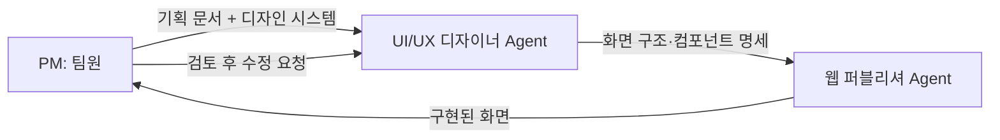
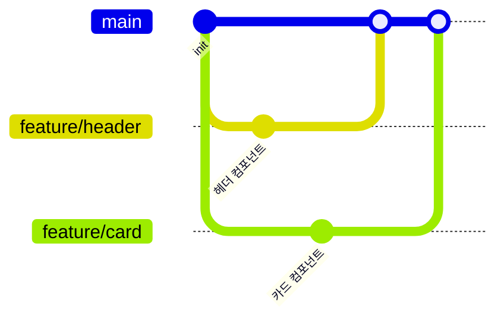

# <주소 입력 동선 자동 생성 플랫폼>

> <누구의 어떤 문제를 어떻게 푸는지, 한 문장>

| 항목 | 내용 |
|---|---|
| 팀명 | <인사팀> |
| 팀원 | <김예린(역할)>, <류다연(역할)>, <양다연(역할)>, <박유수(역할)> |
| 기간 | 2026.09.07 ~ 2026.09.21 |
| 배포 링크 |< https://pinder-one.vercel.app/ >  |
| 피그마 | <없음> |
| Claude Design |< https://claude.ai/design/p/f9f84bdd-ea4c-4e76-b7bc-cad662483c31?file=Route+Planner+App.dc.html&via=share > |

---

## 1. 프로젝트 소개

### 문제 정의 [추정: 01-Hello-project-overview.md의 여러 항목을 종합]
- 타깃 사용자: 국내에서 여행·데이트·모임 등으로 여러 장소를 이동해야 하는 사람들(외국인 포함)
- 겪는 문제: 약속 장소나 목적지는 정해져 있어도, 주변에서 무엇을 할지와 장소 간 이동 순서를 함께 고려한 효율적인 일정을 짜기 어렵다
- 우리의 해결: 목적지를 입력하면 AI가 최적화된 일정과 이동 동선을 자동으로 생성해 주고("장소 입력 → AI가 최적 경로 생성 → 세부 정보 추가해 커스텀"), 생성 이후에도 같은 화면(플래너)에서 계속 수정할 수 있다

### MVP 기능
| 우선순위 | 카테고리 | 기능 | 상태 |
|---|---|---|---|
| 1 | 장소 탐색 | 목적지 검색 및 추가 | 완료 |
| 2 | 장소 탐색 | 지도에 목적지 표시 | 완료 |
| 3 | 경로 계산 | 출발지 선택 및 경로 계산 | 일부 구현 |
| 4 | 경로 계산 | 최단시간·최단거리 경로 계산 | 일부 구현 |
| 5 | 경로 계산 | 변수·가중치 적용 | 일부 구현 |

> [추정] 3, 5행은 04-Hello-features.md의 F7·F8을 매핑/결합한 값 (근거: F7 부분 성숙도, F8 완성)

### 범위에서 제외한 것
- 실시간으로 변동(교통·날씨 등)을 감지해 동선을 자동으로 재조정하는 기능 — 이유: 팀이 기획 단계에서 사용하지 않기로 결정했고, 실제로도 사용자가 "변수 추가"를 직접 눌러야 재계산이 시작된다(자동 감지 기능 자체가 코드에 없음)(근거: 03-Hello-requirements.md "검토했으나 제외")

### 정상 흐름 [추정: 04-Hello-features.md 여러 기능을 순서대로 재구성]
1. 홈에서 "최적 동선 생성하기"(또는 "＋ 새 일정") 클릭 → 2. 생성 방식(직접/AI) 선택 후 날짜 지정 → 3. (직접) 방문지를 검색·지도클릭·현재위치로 추가 / (AI) 지역·스타일·관심사·동행·이동수단 입력 후 자동 생성 → 4. 플래너에서 경로 최적화 결과 확인 및 편집 → 5. 저장 완료

### 예외 흐름
| 상황 | 사용자에게 보이는 것 | 다음 행동 | 구현 여부 |
|---|---|---|---|
| 필수 입력이 비어 있음(예: 커뮤니티 글쓰기 시 사진 0장 또는 지역·감상평 공백) | 인라인 오류 문구(예: "사진을 1장 이상 첨부해주세요.") | 값 보완 후 재시도 | ✅ |
| 데이터가 하나도 없음(빈 상태, 예: 커뮤니티 검색/필터 결과 없음) | "검색 결과가 없어요" / "아직 게시물이 없어요" 안내 | 다른 조건으로 검색 또는 첫 글 작성 | ✅ |
| 일정 저장 중 서버 오류 | "저장하지 못했어요. 다시 시도해주세요." 토스트, 화면은 저장 전 상태 유지 | 다시 저장 시도 | ✅ |
| 비로그인 상태에서 저장/새 일정 만들기/편집 권한 요청 시도 | 화면마다 다름 — 로그인 필요 모달 또는 즉시 `/login` 이동 | 로그인 또는 회원가입 | ✅ |

### 기획 문서
- <확인 필요: 아래 파일들과의 매핑(라벨)이 맞는지, 링크를 이 파일(plan/Hello-plan-docs/READ_ME.md) 기준 상대경로로 넣어도 되는지 확인 필요> [PRD](03-Hello-requirements.md) · [유저 스토리](07-Hello-user-stories.md) · [화면 흐름](08-Hello-screen-flow.md)

---

## 2. 디자인 시스템


### 사용 도구와 역할
| 도구 | 어느 단계에 썼나 | 원본 여부 |
|---|---|---|
| 피그마 | <예: 색·타이포·컴포넌트 정의> | <원본 / 참고> |
| Claude Design | <예: 시스템 기반 화면 생성·변형> | <원본 / 참고> |

### 정의
| 구분 | 정의 | 피그마 | Claude Design |
|---|---|---|---|
| 색상 | Primary <#hex>, Secondary <#hex>, Background <#hex> | ✅ | ✅ |
| 타이포 | 제목 <글꼴/크기>, 본문 <글꼴/크기> | ✅ | ✅ |
| 아이콘 | Lucide | ✅ | ✅ |

### 컴포넌트 목록
- Button (primary / secondary / disabled)
- Card
- Header
- <추가 컴포넌트>

### 디자인 vs 구현
| 피그마 | Claude Design | 실제 화면 |
|---|---|---|
|  |  |  |

---

## 3. Agent 구성



### 역할별 Agent
| Agent | 역할 | 입력 | 출력 | 제약 |
|---|---|---|---|---|
| UI/UX 디자이너 | <책임> | <받는 것> | <내놓는 것> | <하지 말 것> |
| 웹 퍼블리셔 | <책임> | <받는 것> | <내놓는 것> | <하지 말 것> |

### 지시문 핵심 발췌
```
<가장 효과가 컸던 지시문 5~10줄>
```

### 지시문 수정 이력
- v1 → v2: <무엇을 왜 바꿨나>

---

## 4. 프로젝트 규칙 (하네스)

### CLAUDE.md 핵심
- 코드 컨벤션: 주석은 한글, 변수·함수명은 영어
- 폴더 구조: <요약>
- 금지 사항: <예: 디자인 시스템에 없는 색 사용 금지>

### 만들어 둔 Skill / 재사용 프롬프트
| 이름 | 하는 일 | 사용 횟수 |
|---|---|---|
| <skill 이름> | <설명> | <N>회 |

### 검증 절차
1. <결과물을 무엇으로 확인했나>
2. <틀렸을 때 어떻게 되돌렸나>

**실제 사례**: <Claude가 잘못 만든 것 → 어떻게 발견 → 어떻게 수정>

---

## 5. 협업 방식

### 브랜치 전략


- 브랜치 종류: `main`(배포용) / `feature/<기능명>`(기능 개발) / <필요 시 추가>
- 브랜치 이름 규칙: `feature/<이슈번호>-<기능명>` (예: `feature/12-header`)
- 합치기 규칙: PR 생성 → 팀원 1명 리뷰 → main 병합 → 브랜치 삭제

### 이슈 활용
| 이슈 | 담당 | 라벨 | 연결 PR | 상태 |
|---|---|---|---|---|
| #<번호> <제목> | <이름> | <feature / bug / design> | #<번호> | 완료 |

- 이슈 템플릿 사용 여부: <예 / 아니오> → `.github/ISSUE_TEMPLATE/`


### PR 활용
- PR 템플릿: `.github/PULL_REQUEST_TEMPLATE.md` (<있음 / 없음>)
- PR 본문 필수 항목: 작업 내용 / 스크린샷 / `closes #이슈번호`
- 리뷰 규칙: <누가, 무엇을 확인하고 승인하는가>
- 총 PR 수: <N>개, 리뷰 코멘트가 오간 PR: <N>개

### 역할 분담
| 팀원 | 담당 영역 | 담당 이슈 | 주요 PR |
|---|---|---|---|
| <이름> | <영역> | #<번호>, #<번호> | #<번호> |

### 병렬 작업 방법
- <서로 겹치지 않게 어떻게 나눴나>

### 충돌 해결 사례
- <언제, 어디서, 어떻게 해결했나>


---

## 6. 데모

- 실행 방법: <배포 링크 또는 로컬 실행 방법>
- 시연 순서: <서비스를 어떤 흐름으로 보여줄지>

---

## 7. 회고

### 잘 된 점
- <구체적 사례>

### 실패 사례와 개선
| 무엇이 실패했나 | 왜 | 어떻게 고쳤나 |
|---|---|---|
| <사례> | <원인> | <개선> |

### 팀 안에서 공유한 Claude 활용 노하우
- <템플릿·문서·규칙>

### 다음 프로젝트에서 다르게 할 것
1. <실행 가능한 수준으로>
2. <...>
