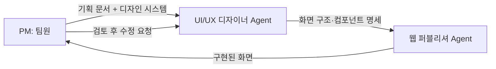
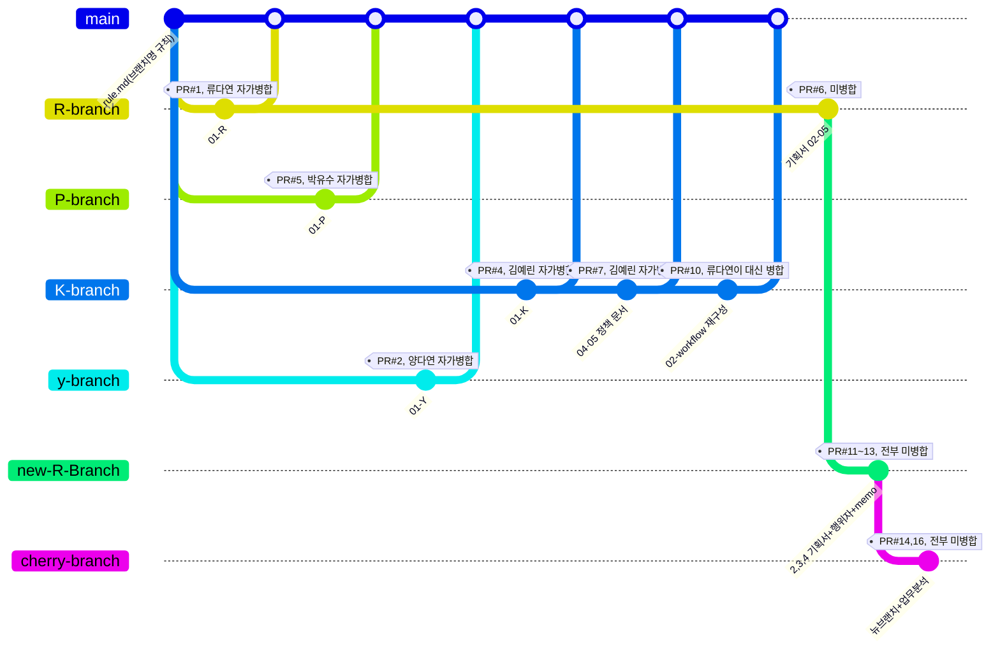
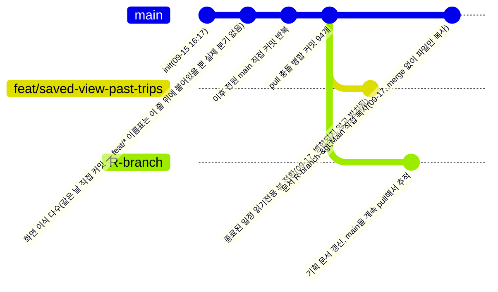

# <주소 입력 동선 자동 생성 플랫폼>

> <누구의 어떤 문제를 어떻게 푸는지, 한 문장>

| 항목 | 내용 |
|---|---|
| 팀명 | <인사팀> |
| 팀원 |  <김예린(Next.js 전환·배포 환경 구축, DB·인증·이메일·지도·AI 연동, 플래너 경로 계산/최적화 개발)>, <류다연(서비스 기획·정책 문서화, AI 가중치 기반 최적경로 기능, 내 일정 권한·개인화 기능 개발)>, <양다연(AI 도우미(챗봇)·AI 동선 생성 기능 개발, 초대·공유 권한 체계, 탐색 페이지 콘텐츠 구성)>, <박유수(Route Planner·커뮤니티·알림 기능 개발, 온보딩(Product Tour)·화면 UI 다듬기, 모바일 반응형 전면 작업)> |
| 기간 | 2026.09.07 ~ 2026.09.21 |
| 배포 링크 |< https://pinder-one.vercel.app/ >  |
| 피그마 | <없음> |
| Claude Design |< https://claude.ai/design/p/f9f84bdd-ea4c-4e76-b7bc-cad662483c31?file=Route+Planner+App.dc.html&via=share > |

---

## 1. 프로젝트 소개

### 문제 정의 [추정: 01-Hello-project-overview.md의 여러 항목을 종합]
- 타깃 사용자: 국내에서 여행·데이트·모임 등으로 여러 장소를 이동해야 하는 사람들(외국인 포함)
- 겪는 문제: 약속 장소나 목적지는 정해져 있어도, 주변에서 무엇을 할지와 장소 간 이동 순서를 함께 고려한 효율적인 일정을 짜기 어렵다
- 우리의 해결: 목적지를 입력하면 AI가 최적화된 일정과 이동 동선을 자동으로 생성해 주고("장소 입력 → AI가 최적 경로 생성 → 세부 정보 추가해 커스텀"), 생성 이후에도 같은 화면(플래너)에서 계속 수정할 수 있다

### MVP 기능
| 우선순위 | 카테고리 | 기능 | 상태 |
|---|---|---|---|
| 1 | 장소 탐색 | 목적지 검색 및 추가 | 완료 |
| 2 | 장소 탐색 | 지도에 목적지 표시 | 완료 |
| 3 | 경로 계산 | 출발지 선택 및 경로 계산 | 완료 |
| 4 | 경로 계산 | 최단시간·최단거리 경로 계산 | 완료 |
| 5 | 경로 계산 | 변수·가중치 적용 | 완료 |

### 범위에서 제외한 것
- 교통·날씨 등 변동을 자동으로 감지해 동선을 재조정하는 기능    - 이유: 기획 단계에서 제외 결정, 대신 사용자가 "변수 추가"를 눌러야 재계산 시작
  

### 정상 흐름
1. 홈에서 "새 일정 만들기" 클릭 → 2. 생성 방식(직접/AI) 선택 및 날짜 지정 → 3. 방문지 추가(검색·지도클릭·현재위치, 또는 AI 자동 생성) → 4. 경로 계산 및 편집 → 5. 저장 완료

### 예외 흐름
| 상황 | 사용자에게 보이는 것 | 다음 행동 | 구현 여부 |
|---|---|---|---|
| 필수 입력이 비어 있음(예: 커뮤니티 글쓰기 시 사진 0장) | 인라인 오류 문구(예: "사진을 1장 이상 첨부해주세요.") | 값 보완 후 재시도 | ✅ |
| 데이터가 하나도 없음(빈 상태, 예: 커뮤니티 검색/필터 결과 없음) | "검색 결과가 없어요" / "아직 게시물이 없어요" 안내 | 다른 조건으로 검색 또는 첫 글 작성 | ✅ |
| 일정 저장 중 서버 오류 | "저장하지 못했어요. 다시 시도해주세요." 토스트, 화면은 저장 전 상태 유지 | 다시 저장 시도 | ✅ |
| 비로그인 상태에서 저장/새 일정 만들기/편집 권한 요청 시도 | 화면마다 다름 — 로그인 필요 모달 또는 즉시 `/login` 이동 | 로그인 또는 회원가입 | ✅ |
| AI 추천 장소의 좌표를 카카오에서 못 찾음(대체 후보로 최대 3회 재시도 후에도 실패) | "좌표 매칭에 실패했습니다" 모달 — 해당 장소는 제외하고 진행(전부 실패 시 "조건을 바꾸거나 다시 시도해주세요.") | 나머지 장소로 계속 진행, 또는 조건 변경 후 재시도 | ✅ |

### 기획 문서
- <확인 필요: 아래 파일들과의 매핑(라벨)이 맞는지, 링크를 이 파일(plan/Hello-plan-docs/READ_ME.md) 기준 상대경로로 넣어도 되는지 확인 필요> [PRD](03-Hello-requirements.md) · [유저 스토리](07-Hello-user-stories.md) · [화면 흐름](08-Hello-screen-flow.md)

---

## 2. 디자인 시스템


### 사용 도구와 역할
| 도구 | 어느 단계에 썼나 | 원본 여부 |
|---|---|---|
| 피그마 | <예: 색·타이포·컴포넌트 정의> | <원본 / 참고> |
| Claude Design | <예: 시스템 기반 화면 생성·변형> | <원본 / 참고> |

### 정의
| 구분 | 정의 | 피그마 | Claude Design |
|---|---|---|---|
| 색상 | Primary <#hex>, Secondary <#hex>, Background <#hex> | ✅ | ✅ |
| 타이포 | 제목 <글꼴/크기>, 본문 <글꼴/크기> | ✅ | ✅ |
| 아이콘 | Lucide | ✅ | ✅ |

### 컴포넌트 목록
- Button (primary / secondary / disabled)
- Card
- Header
- <추가 컴포넌트>

### 디자인 vs 구현
| 피그마 | Claude Design | 실제 화면 |
|---|---|---|
|  |  |  |

---

## 3. Agent 구성



### 역할별 Agent
| Agent | 역할 | 입력 | 출력 | 제약 |
|---|---|---|---|---|
| UI/UX 디자이너 | <책임> | <받는 것> | <내놓는 것> | <하지 말 것> |
| 웹 퍼블리셔 | <책임> | <받는 것> | <내놓는 것> | <하지 말 것> |

### 지시문 핵심 발췌
```
<가장 효과가 컸던 지시문 5~10줄>
```

### 지시문 수정 이력
- v1 → v2: <무엇을 왜 바꿨나>

---

## 4. 프로젝트 규칙 (하네스)

### CLAUDE.md 핵심
- 코드 컨벤션: 주석은 한글, 변수·함수명은 영어
- 폴더 구조: <요약>
- 금지 사항: <예: 디자인 시스템에 없는 색 사용 금지>

### 만들어 둔 Skill / 재사용 프롬프트
| 이름 | 하는 일 | 사용 횟수 |
|---|---|---|
| <skill 이름> | <설명> | <N>회 |

### 검증 절차
1. <결과물을 무엇으로 확인했나>
2. <틀렸을 때 어떻게 되돌렸나>

**실제 사례**: <Claude가 잘못 만든 것 → 어떻게 발견 → 어떻게 수정>

---

## 5. 협업 방식

### 브랜치 전략

> [확인 필요 해결] 처음 그렸던 그래프는 기획 저장소의 PR 4개(#1,2,3,5)만 보여주고 나머지 PR(#4,6,7,10,11,12,13,14,16)과 개발 저장소의 실제 브랜치 상태(대부분 "브랜치"라는 이름만 있고 실제로는 분기된 적이 없음)를 빠뜨리고 있었음. 두 저장소의 **전체 브랜치 목록과 각 브랜치 tip 커밋의 부모 수(`git log -1 --format=%P`)**를 다시 확인해서, 실제로 분기(부모 2개=merge 또는 서로 다른 부모 라인)가 있었던 브랜치만 그래프에 반영하고, 나머지는 아래 글로 왜 그래프에서 뺐는지 설명함.

**기획 단계(`hello-planning`) — 실제로 분기·병합이 일어난 브랜치, PR 1~16번 전부 반영**

- PR 13건 중 7건(#1,2,3,4,5,7,10)은 각자 자기 PR을 스스로 merge 버튼을 눌러 병합함(자가병합) — 유일하게 **PR#10**은 김예린이 열었지만("02-R-workflow.md 재구성... 류다님 확인 바랍니다") 실제 병합은 류다연이 함(`55a6025`, 09-10 17:11) — 이 저장소 전체에서 "내가 아닌 다른 사람이 리뷰하고 병합해준" 유일한 사례
- PR#6(류다연, `R-branch`)이 막힌 뒤 `new-R-Branch`(류다연이 실제 커밋 작성, PR은 김예린이 대신 열어줌 — `git log`상 커밋 작성자와 PR#11의 GitHub 작성자가 다름)로, 다시 `cherry-branch`로 두 번 더 새 브랜치를 파서 재시도했지만 PR#11~14·16 다섯 건 모두 병합되지 못함

**개발 단계(`pinder`) — "브랜치"라는 이름은 있지만 실제로는 분기가 거의 없었음**

- `feat/google-login`·`feat/home-page-port`·`feat/login-signup-screens`·`feat/planner-screen`·`feature/migration`: 5개 브랜치 tip 커밋을 전부 확인한 결과 **부모가 1개뿐**임(`git log -1 --format=%P`) → 실제로 분기된 적이 없고, 같은 한 줄의 커밋 위에 이름표만 붙어 있는 상태. 그래서 위 그래프에는 넣지 않고 "화면 이식 다수" 한 줄로만 표시함
- `feat/saved-view-past-trips`: 유일하게 진짜로 갈라진 브랜치 — `main`에 없는 커밋이 정확히 1개 있음(`a487d9a` 김예린, 09-17 09:57, "종료된 일정을 KST 기준 저장된 뷰(읽기 전용)로 전환") — 지금까지 병합되지 않고 그대로 방치돼 있음. 이게 바로 02-Hello-workflow.md에서 "확인되지 않은 분기"로 적어둔 "일정 종료 후에도 편집·저장·초대가 그대로 동작한다"는 문제의 원인 — 그 기능을 실제로 만들다가 병합을 안 한 것
- `R-branch`: 기획 저장소의 `R-branch`와 이름만 같은 별개 브랜치. 류다연이 `origin/main`을 반복해서 merge해 들여오며(`041905b` 등) 기획 문서를 갱신하다가, 09-17에 결국 PR·merge 없이 `069a41c 문서 R-branch->Main 옮김` 커밋으로 파일만 `main`에 복사해 넣고 끝남

- 브랜치 이름 규칙: 기획 단계는 `<성 이니셜>-branch`, 개발 단계 초기엔 `feat/<화면명>`(그러나 위에서 확인했듯 실제로 분기되지는 않음). 이슈 번호를 붙이는 규칙(`feature/<이슈번호>-<기능명>`)은 두 저장소 어디에서도 실제로 쓰인 적이 없음(전체 커밋 메시지에 `#<숫자>` 형태 이슈 참조 0건)
- 합치기 규칙: 기획 단계는 "PR 생성 → (대부분 자가)병합"을 실제로 시도했음(총 PR 13건 중 7건 병합, 아래 "PR 활용" 참고). 개발 단계로 넘어오면서는 PR 없이 "각자 `main`에 직접 커밋 → 로컬 `git pull`로 병합 → 충돌은 로컬에서 직접 해결"로 바뀌었음(병합 커밋 95개 전부 pull 충돌 해소용, `Merge pull request` 흔적 0건)
- 이번 README.md 문서화(2~5·6·7절)부터는 팀원별로 각자 브랜치를 파서 PR로 병합하는 방식을 다시 시도하기로 함 — 2절(디자인 시스템) 박유수, 3·4절(Agent 구성/프로젝트 규칙) 류다연, 5·6절(협업 방식·데모, 본 절 포함) 김예린, 7절(팀 회고) 양다연

### 이슈 활용

| 이슈 | 생성일 | 작성자(=사실상 담당) | 라벨 | 담당자(assignee) | 체크리스트 진행률 | 댓글 | 연결 PR | 상태 |
|---|---|---|---|---|---|---|---|---|
| #8 "9/10 - 프로토타입 기반으로 기획서 수정할 것" | 09-10 | 류다연 | (없음) | (없음) | 6/6 (100%, 그날 오후 할 일 전부 완료 처리) | 0 | 없음 | open(닫힌 적 없음) |
| #9 "문서 2,3,4번 수정사항" | 09-10 | 김예린 | (없음) | (없음) | 0/18 (0%) | 0 | 없음 | open(닫힌 적 없음) |
| #15 "할 일 정리" | 09-14 | 류다연 | (없음) | (없음) | 1/219 (0.5%) | 0 | 없음 | open(닫힌 적 없음) |

- #8은 그날(09-10) 오후에 할 일 6개(클로드 디자인 화면 흐름 정리, 코드 받아오기, 행위자 정리, 02문서 작성 등)를 적고 전부 체크 완료한, 하루짜리 실행 로그에 가까운 이슈
- #9는 김예린이 "2,3,4번 문서 위주로 손보면 4·5번은 저절로 고쳐질듯" 하는 메모로 시작해서, 02·03·04번 문서 각각에 번호가 붙은 수정 항목(예: "(25) **중요** 변수 추가 - 날씨, 짐 등")을 나열했지만 체크된 항목이 하나도 없음 — 체크리스트를 실행 추적용이 아니라 "생각 정리용 메모"로만 쓴 사례
- #15는 세 이슈 중 가장 크고(체크박스 219개), 기획·화면 구현·권한 UI·Route Planner 기능·페이지 연결·실제 DB 연동·실제 권한 적용·공유 기능·실시간 동기화·테스트·회원가입/인증까지 11개 섹션으로 나눈 "시작 기능 구현" 전체 로드맵이며, 안에 A1(제작자)/A2(편집자)/Viewer/Saved-Viewer 역할 흐름을 그린 mermaid 다이어그램까지 포함돼 있음. 체크된 항목은 "사용자 역할 지정" 1개뿐이지만, 이 이슈에 적힌 역할·권한 흐름은 이후 실제 코드(`src/db/schema.ts`의 `scheduleCollaborators.role`, `02-Hello-workflow.md`의 A1~A4 행위자 표)와 거의 그대로 일치함 — 체크박스로는 진행률을 전혀 추적하지 않았지만, 실질적으로는 설계 문서로 계속 참조된 것으로 보임
- 담당자(assignee) 필드는 세 이슈 모두 비어 있음 — "만든 사람이 곧 담당자"라는 암묵적 규칙만 있었고 GitHub의 담당자 지정 기능 자체를 쓰지 않음
- 댓글은 세 이슈 모두 0건 — 팀 내 논의는 이슈 댓글이 아니라 다른 채널(Slack 등, [확인 필요])로 이뤄진 것으로 보임
- 세 이슈 모두 지금까지 **닫힌 적이 없음**(`closed_at: null`) — 저장소가 `pinder`로 옮겨가면서 정리 없이 그대로 두고 온 것
- 이슈-PR 연결(`Closes #`, `Fixes #`) 관행은 0건 — 이슈 본문·PR 본문 어디에도 서로를 참조하는 표현이 없음
- 이슈 템플릿 사용 여부: 아니오 → 코드 저장소(`pinder`)의 `.github/ISSUE_TEMPLATE/`(버그 신고·기능 요청·화면 작업)는 만들어져 있지만 실제 이슈가 하나도 없음(0건). 기획 저장소(`hello-planning`)의 이슈 3건(위 표)도 템플릿 없이 자유 형식(체크리스트)으로 작성됐고 라벨도 전혀 쓰지 않음 — "추적할 문제"가 아니라 "todo 메모장"으로 쓴 것


### PR 활용
- PR 템플릿: `pinder`에는 `.github/PULL_REQUEST_TEMPLATE.md` 있음(작업 내용/관련 이슈/lint·typecheck·build 체크리스트/라이트·다크·모바일 확인/스크린샷) — 그러나 실제 PR 자체가 없어 쓰인 적이 없음. `hello-planning`에는 별도 템플릿 없이 자유 형식으로 PR을 열었음(본문이 "01-K" 한 줄뿐인 경우가 대부분)
- PR 본문 필수 항목(템플릿상): 작업 내용 / 스크린샷 / `closes #이슈번호` — 그러나 실제 병합된 PR(`hello-planning` #1,2,3,4,5,7,10)의 본문은 한 줄 제목뿐이라 이 형식이 실제로 지켜진 적은 없음
- 리뷰 규칙: `pinder`의 CODEOWNERS(`@팀장`/`@담당자`)는 실제 GitHub 계정으로 치환되지 않은 채 남아 있어 강제되는 리뷰가 없었음. 다만 `hello-planning`의 PR#10 제목("...류다님 확인 바랍니다")처럼 특정 팀원을 지목해 리뷰를 요청하는 관행은 있었고, PR#6에는 실제 인라인 리뷰 코멘트가 12건 오갔음(양다연: "05번 파일 정책... 추가하면 좋을 거 같습니다", 김예린: "문서 2,3까지만 완료함" 등)
- 총 PR 수: `hello-planning` 13개(#1~16, 결번 8·9·15는 위 이슈 번호), `pinder` 0개. 리뷰 코멘트가 오간 PR: 3개(#6에 12건, #12·#13에 각 1건) — 나머지 10개는 코멘트 없이 병합되거나 방치됨. 병합 결과는 7건 병합(#1,2,3,4,5,7,10 — 전부 기획 첫 주 09-08~09-10) / 6건 미병합(#6,11,12,13,14,16 — 류다연이 `R-branch`→`new-R-Branch`→`cherry-branch`로 계속 새 브랜치를 파며 재시도했지만 끝내 병합되지 못하고 방치됨, 09-17에 `069a41c` 커밋으로 PR 없이 `main`에 직접 복사해 넣으며 마무리) [확인 필요: 이번 README 문서화 PR이 병합되면 `pinder`의 "0개"를 실제 개수로 갱신]

### 역할 분담

> [근거] 두 저장소의 커밋을 모두 합쳐서 다시 작성함 — 기획 저장소(`hello-planning`, 4명 합계 43커밋)는 `git log --all --author=<계정>`으로 실제 커밋 제목을 전부 읽고, 개발 저장소(`pinder`, 4명 합계 337커밋)는 `git log --author=<계정> --numstat`으로 실제 변경 파일을 집계함(커밋 메시지의 `fix(범위):` 스코프 표기가 아니라 실제 diff 기준).

| 팀원 | 기획 단계(`hello-planning`, 총 커밋) | 개발 단계(`pinder`, 총 커밋) | 담당 이슈 | 주요 PR |
|---|---|---|---|---|
| 김예린 (`paaaraaaeaaa`) | 12커밋 — "01-K" 작성 후 P/R/y 3개 브랜치를 K-branch로 직접 merge해 "01통합본" 정리, 04·05번 정책 문서 추가, 02-workflow 재구성(단 병합은 류다연이 대신 해줌) | 135커밋 — 09-15 초기 화면 이식 다수를 직접 작성, 이후 플래너 핵심 로직(`PlannerClient.tsx` 46회)·인증(`api/auth` 24회)·일정 API(`api/schedules` 16회)·마이페이지(16회) 담당. 미병합 상태로 남은 `feat/saved-view-past-trips`("종료된 일정 읽기전용 뷰 전환")도 본인 작업 | #9 | #4, #7, #10 (전부 병합) |
| 박유수 (`yoosoo2217`) | 8커밋 — `rule.md`(브랜치명 규칙 자체를 작성)로 시작, "저장"(01-P), 유사 서비스 조사 3건, `01-merged.md` 리네임·정리 | 94커밋 — 커뮤니티 화면(30회), 플래너 모바일 반응형 CSS(`planner.module.css` 21회 — 뒤로가기 버튼 위치를 5번 반복 수정한 것도 포함), 내 일정 카드(7회) | (없음) | #5 (병합) |
| 양다연 (`yang7493`) | 4커밋 — "첫번째 파일"(01-Y), 유사 서비스 조사·표 수정 2건 | 65커밋 — `PlannerClient.tsx`(17회)·내 일정(`routes` 17회)·AI 도우미(`api/chat` 13회, "생성 AI와 대화로 수정" 기능)·탐색 페이지(11회)·플래너 모바일 버튼 위치(7회, AI도우미/현재위치 버튼 겹침을 7번 반복 수정) | (없음) | #2 (병합) |
| 류다연 (`dyryoo316`) | 18커밋(4명 중 최다) — "pr 01파일 템플릿"·"01-R"로 시작, "문제상황 및 아이디어 1차 작성" 등 초기 기획을 주도. PR#6이 리뷰까지 받고도 막힌 뒤 `new-R-Branch`("2,3,4 기획서 커밋"·"02 파일 행위자·스탭 추가"·"로그인에 따른 행위자 기능 반영")→`cherry-branch`("뉴브랜치"·"업무 분석 커밋")로 두 번 더 재시도했지만 전부 미병합. 유일하게 김예린의 PR#10을 대신 병합해줌 | 43커밋 — `PlannerClient.tsx`(14회, "출발지 선택" 팝업 흐름)·내 일정 개인화(`routes` 7회)·커뮤니티(5회)·인증(`api/auth` 4회). 기획 저장소의 `R-branch`를 코드 저장소에서도 이어가다가 결국 09-17에 PR 없이 `main`에 문서를 직접 복사 | #8, #15 | #1, #3 (병합) · #6, #11~14, #16 (미병합) |

> `PlannerClient.tsx`는 네 명 모두가 상위권으로 고친 파일이고(김예린 46 · 양다연 17 · 류다연 14 · 박유수 8), `planner.module.css`도 세 명이 반복해서 고쳤다(박유수 21 · 김예린 18 · 양다연 13 — 류다연은 이 파일을 건드린 적 없음). 이렇게 겹치는 구조가 아래 "충돌 해결 사례"의 반복 수정·되돌림으로 이어졌다.

### 병렬 작업 방법
- 기획 단계: 팀원 성 이니셜별 브랜치로 문서 영역을 나눠 각자 작성(01-K/01-P/01-R/01-Y를 각자 담당). 이후 통합 문서(02~05번)는 김예린·류다연이 번갈아 정리
- 개발 단계: 이슈·PR로 사전 배분하지 않았지만, 실제 diff 기준으로 화면(디렉터리) 단위 분업이 어느 정도 자리 잡혀 있었음 — 김예린은 인증/일정 API 백엔드 + 플래너 로직, 박유수는 community + 플래너 CSS, 양다연은 explore/AI 챗 + 플래너 버튼, 류다연은 routes 개인화 + 플래너 팝업 흐름(근거: 위 역할 분담 표)
- 다만 `PlannerClient.tsx`·`planner.module.css` 두 파일은 네 명 전원의 작업 영역이 겹치는 지점이었고, 실제로 이 두 파일에서 반복 수정과 되돌림이 몰려 있었음(아래 참고)

### 충돌 해결 사례
- **기획 단계 — PR#6(류다연, `R-branch`) 리뷰는 했지만 끝내 병합 못함**: 양다연·김예린이 실제로 인라인 리뷰 코멘트 12건을 남겼는데도("05번 파일 정책... 추가하면 좋을 거 같습니다" 등) 반영·재승인까지 이어지지 않고 09-11에 병합 없이 종료됨. 류다연은 이후 `new-R-Branch`(PR#11~13)→`cherry-branch`(PR#14, 16)로 계속 새 브랜치를 만들어 재시도했지만 전부 병합되지 못했고, 결국 코드 저장소로 넘어온 뒤 09-17에 `069a41c` 커밋으로 PR 없이 `main`에 문서를 직접 복사해 넣으며 마무리함 — "리뷰는 있었지만 반영·재병합 절차가 끝까지 지켜지지 않은" 사례
- **회원탈퇴 후 로그인 화면 이동 — Revert 충돌(2026-09-16)**: 김예린이 `MyPageClient.tsx`의 일반 탈퇴 처리(`onConfirmWithdraw`)에 `router.push('/login')` 3줄을 추가(`067f9fc`, 11:39) → 13분 뒤 양다연이 그 3줄을 `git revert`로 통째로 삭제(`1e8c103`, 11:52) → 10분 뒤 김예린이 같은 3줄을 재적용(`7f59765`, 12:02)하며 커밋 메시지에 "팀원이 별다른 설명 없이 revert 했는데, 테스트로 확인된 실제 버그 수정이라 다시 적용한다"고 직접 기록. diff가 3줄 추가/3줄 삭제로 완전히 대칭이라 코드 충돌은 아니고, 사전 소통 없이 되돌렸다가 다시 되돌려진 사건임(왜 되돌렸는지는 기록에 남아있지 않아 [확인 필요]). 개선안: 같은 영역(인증/마이페이지) 작업 전 담당·범위를 먼저 공지하고, `git revert`처럼 되돌리는 작업은 사유를 남기기
- **플래너의 "출발지 선택" 팝업 흐름 — 류다연이 같은 날 4번 고침**: `114ecb4`(추가 후 되돌아갈 팝업을 "목록"에서 "출발지 확정"으로 변경) → `b4eacf0`("취소"를 "이전"으로 바꾸고 스크롤 추가) → `7d8159b`(ESC/뒤로가기 처리에 `returnToOriginPickerAfterAdd` 상태 확인 로직 추가) → `b2d8349`·`3349a20`(위 흐름 재조정). git 충돌은 아니지만, 추가 후 어느 팝업으로 돌아가야 하는지에 대한 요구사항이 구현 중 계속 바뀐 사례
- **플래너 모바일 버튼 위치 — 박유수·양다연이 `planner.module.css`를 반복 수정**: 박유수는 지도 화면 "뒤로가기" 버튼이 검색 오버레이와 겹치는 문제를 09-17에 5번 수정(`602267a`에서 버튼 JSX를 `mapCol` 밖에서 `mapArea` 안으로 옮김); 양다연은 AI 도우미·현재 위치 버튼이 하단 요약바와 겹치는 문제를 09-18 아침에 7번 연속 수정(`ddcc42c`→...→`f27b62e`) — 전부 CSS `position`/`z-index`만 계속 바꾸며 한 번에 맞는 값을 못 찾은 패턴


---

## 6. 데모

### 실행 방법


- **배포 링크**: <https://pinder-one.vercel.app/> — `main`에 push하면 Vercel Git Integration이 자동으로 새 프로덕션 배포를 만듦. 이 저장소 자체의 CI(`ci.yml`)는 lint·typecheck·build 검증만 하고 실제 배포는 하지 않으므로, 배포 성공 여부는 GitHub 커밋 상태가 아니라 **Vercel 대시보드**(또는 PR에 자동으로 달리는 Vercel 프리뷰 배포 코멘트)에서 확인해야 함 [확인 필요: Vercel 대시보드 접근 권한이 없는 팀원은 이 문서에 스크린샷으로 배포 상태를 남겨둘 것]
- 브랜치·PR을 만들면 그 커밋에 대한 **프리뷰 배포**도 Vercel이 자동으로 생성함 — 이번 README 문서화(2~7절)처럼 브랜치별로 PR을 여는 방식으로 바뀌면, 앞으로는 리뷰어가 코드를 직접 받지 않고도 PR의 프리뷰 링크로 화면을 바로 확인할 수 있음
- 로컬에서 직접 띄워야 할 경우, 값을 하나씩 채우는 대신 Vercel에 이미 등록된 실제 배포용 환경 변수를 그대로 받아오는 방법을 씀:
  ```bash
  npm i -g vercel              # Vercel CLI (이 개발 환경에는 아직 설치돼 있지 않음 — 최초 1회만)
  vercel login
  vercel link                  # 이미 연결된 프로젝트 "pinder"를 선택 (.vercel/repo.json 참고)
  vercel env pull .env.local   # KAKAO_JS_KEY / KAKAO_REST_API_KEY / GEMINI_API_KEY / GOOGLE_CLIENT_ID / DATABASE_URL 등을 실제 배포값 그대로 받아옴
  npm install
  npm run dev                  # http://localhost:3000
  ```
- 키를 하나도 못 받아와도 앱 자체는 뜨고, 해당 기능(지도·AI 도우미·구글 로그인 등)만 오류 메시지를 보여줌(근거: `README.md` "환경 변수" 절 "키가 없어도 앱은 뜨고, 해당 기능만 오류 메시지를 보여준다")

### 시연 순서

> [추정: 01번 "정상 흐름"과 02-Hello-workflow.md의 단계(S1~S23)를 시연 동선으로 재구성한 것 — 실제 발표 리허설 후 순서·소요 시간을 확정할 것 [확인 필요]]

1. **홈** — 히어로에서 "최적 동선 생성하기" 클릭 → 로그인 상태 확인
2. **AI로 동선 생성** — 생성 방식에서 "AI 생성하기" 선택 → 날짜 지정 → 지역·스타일·관심사·동행·이동수단 5단계 입력 → AI가 방문지 목록과 순서를 자동 생성하는 과정을 보여줌(필요하면 "다시 추천받기"로 재생성 1회 시연)
3. **플래너에서 편집** — 생성된 결과를 "이 일정으로 시작하기"로 넘겨 플래너 화면 진입 → 지도 클릭으로 방문지 추가, 순서 변경, "경로 계산"으로 최단시간/최단거리 최적화 결과 확인
4. **변수 반영** — "변수 추가"에서 날씨/짐 등 상황을 골라 AI로 동선을 재구성하는 모습을 보여줌(F7·F8 관련, MVP 표의 "일부 구현" 항목)
5. **공유·권한** — "＋ 일행 초대"로 편집/보기 링크 발급 → 다른 탭(또는 시크릿 창)에서 링크로 접속해 뷰어로 들어가는 것까지 보여줌 → 편집 권한 요청 → 제작자가 승인하는 흐름
6. **탐색·커뮤니티** — `/explore`에서 준비된 AI 동선으로 바로 시작하는 진입점, `/community`에서 방문 기록(사진·후기) 게시물 확인
7. **모바일 반응형** — 브라우저 창을 모바일 폭으로 줄이거나 실제 모바일 기기로 접속해 하단 액션바·AI 도우미 FAB·지도 펼치기 등 모바일 전용 UI를 짧게 보여줌
8. **마무리** — 마이페이지(알림 설정·닉네임 변경)와 알림벨(일정 시작 하루 전 알림 등)을 간단히 짚고 종료

---

## 7. 회고

### 잘 된 점
- <구체적 사례>

### 실패 사례와 개선
| 무엇이 실패했나 | 왜 | 어떻게 고쳤나 |
|---|---|---|
| <사례> | <원인> | <개선> |

### 팀 안에서 공유한 Claude 활용 노하우
- <템플릿·문서·규칙>

### 다음 프로젝트에서 다르게 할 것
1. <실행 가능한 수준으로>
2. <...>
