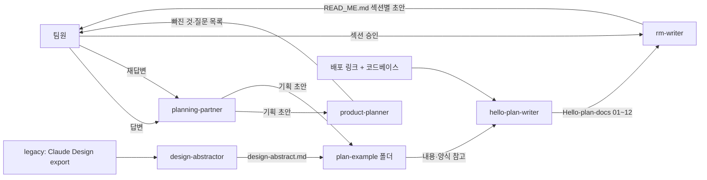
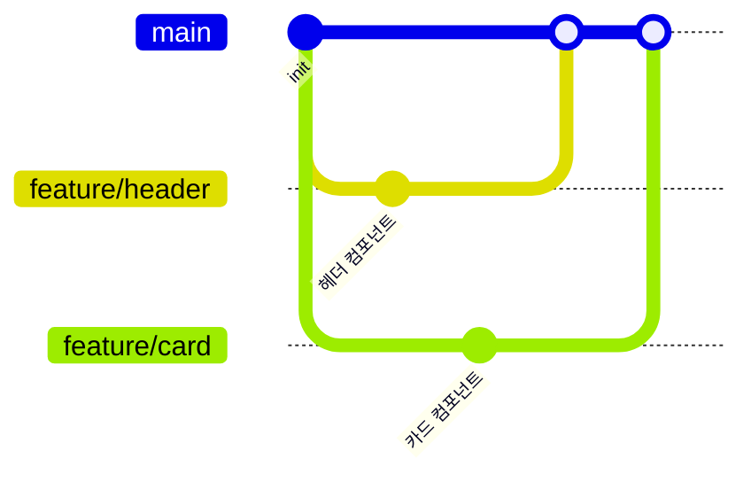

# 주소 입력 동선 자동 생성 플랫폼

> 여러 장소를 이동해야 하는 여행객을 위해, 목적지만 입력하면 AI가 동선과 일정을 자동으로 짜주는 서비스

| 항목 | 내용 |
|---|---|
| 팀명 | 인사팀 |
| 팀원 | 김예린(Next.js 전환·배포 환경 구축, DB·인증·이메일·지도·AI 연동, 플래너 경로 계산/최적화 개발), 류다연(서비스 기획·정책 문서화, AI 가중치 기반 최적경로 기능, 내 일정 권한·개인화 기능 개발), 양다연(AI 도우미(챗봇)·AI 동선 생성 기능 개발, 초대·공유 권한 체계, 탐색 페이지 콘텐츠 구성), 박유수(Route Planner·커뮤니티·알림 기능 개발, 온보딩(Product Tour)·화면 UI 다듬기, 모바일 반응형 전면 작업) |
| 기간 | 2026.09.07 ~ 2026.09.21 |
| 배포 링크 | https://pinder-one.vercel.app/ |
| 피그마 | https://www.figma.com/make/ud387SQMeP4m5WJTFciCXg/Travel-Route-Planner-Wireframe?fullscreen=1&t=kdsf4qiqAWLw50Et-1&code-node-id=0-6 |
| Claude Design | https://claude.ai/design/p/f9f84bdd-ea4c-4e76-b7bc-cad662483c31?file=Route+Planner+App.dc.html&via=share |

---

## 1. 프로젝트 소개

### 문제 정의
- 타깃 사용자: 국내에서 여행·데이트·모임 등으로 여러 장소를 이동해야 하는 사람들(외국인 포함)
- 겪는 문제: 약속 장소나 목적지는 정해져 있어도, 주변에서 무엇을 할지와 장소 간 이동 순서를 함께 고려한 효율적인 일정을 짜기 어렵다
- 우리의 해결: 목적지를 입력하면 AI가 최적화된 일정과 이동 동선을 자동으로 생성해 주고("장소 입력 → AI가 최적 경로 생성 → 세부 정보 추가해 커스텀"), 생성 이후에도 같은 화면(플래너)에서 계속 수정할 수 있다

### MVP 기능
| 우선순위 | 카테고리 | 기능 | 상태 |
|---|---|---|---|
| 1 | 장소 탐색 | 목적지 검색 및 추가 | 완료 |
| 2 | 장소 탐색 | 지도에 목적지 표시 | 완료 |
| 3 | 경로 계산 | 출발지 선택 및 경로 계산 | 완료 |
| 4 | 경로 계산 | 최단시간·최단거리 경로 계산 | 완료 |
| 5 | 경로 계산 | 변수·가중치 적용 | 완료 |

### 범위에서 제외한 것
- 교통·날씨 등 변동을 자동으로 감지해 동선을 재조정하는 기능 — 이유: 기획 단계에서 제외 결정, 대신 사용자가 "변수 추가"를 눌러야 재계산 시작

### 정상 흐름
1. 홈에서 "새 일정 만들기" 클릭 → 2. 생성 방식(직접/AI) 선택 및 날짜 지정 → 3. 방문지 추가(검색·지도클릭·현재위치, 또는 AI 자동 생성) → 4. 경로 계산 및 편집 → 5. 저장 완료

### 예외 흐름
| 상황 | 사용자에게 보이는 것 | 다음 행동 | 구현 여부 |
|---|---|---|---|
| 필수 입력이 비어 있음(예: 커뮤니티 글쓰기 시 사진 0장) | 인라인 오류 문구(예: "사진을 1장 이상 첨부해주세요.") | 값 보완 후 재시도 | ✅ |
| 데이터가 하나도 없음(빈 상태, 예: 커뮤니티 검색/필터 결과 없음) | "검색 결과가 없어요" / "아직 게시물이 없어요" 안내 | 다른 조건으로 검색 또는 첫 글 작성 | ✅ |
| 일정 저장 중 서버 오류 | "저장하지 못했어요. 다시 시도해주세요." 토스트, 화면은 저장 전 상태 유지 | 다시 저장 시도 | ✅ |
| 비로그인 상태에서 저장/새 일정 만들기/편집 권한 요청 시도 | 화면마다 다름 — 로그인 필요 모달 또는 즉시 `/login` 이동 | 로그인 또는 회원가입 | ✅ |
| AI 추천 장소의 좌표를 카카오에서 못 찾음(대체 후보로 최대 3회 재시도 후에도 실패) | "좌표 매칭에 실패했습니다" 모달 — 해당 장소는 제외하고 진행(전부 실패 시 "조건을 바꾸거나 다시 시도해주세요.") | 나머지 장소로 계속 진행, 또는 조건 변경 후 재시도 | ✅ |

### 기획 문서
- **사전 기획**(코딩 시작 직후 작성, 근거: `git log`상 커밋 `d61b43b`, 2026-09-15 17:22 — 첫 코드 커밋 16:58 직후): [문제 정의](../plan-example/01-merged.md) · [요구사항](../plan-example/03-H-requirements.md) · [기능](../plan-example/04-H-features.md)
- **사후 검증**(배포된 코드를 기준으로 역산, 2026-09-18): [PRD](03-Hello-requirements.md) · [유저 스토리](07-Hello-user-stories.md) · [화면 흐름](08-Hello-screen-flow.md)

---

## 2. 디자인 시스템


### 사용 도구와 역할
| 도구 | 어느 단계에 썼나 | 원본 여부 |
|---|---|---|
| 피그마 | 초안 main 화면 참고 및 디자인 방향 확인 / 색상 팔레트 원본 정의 | 참고 |
| Claude Design | Figma의 디자인과 색상 팔레트를 참고하여 초기 프로토타입 제작 및 UI/UX 구체화 | 원본 |
| VS Code / Claude Code | Claude Design에서 구성한 프로토타입을 기반으로 실제 React/Next.js 화면 및 서비스 구현 및 UI/UX 수정 | 구현 |


### 정의
| 구분 | 정의 | 피그마 | Claude Design |
|---|---|---|---|
| 색상 | Brand `#7BCB93`, Brand-strong `#63B37E`, Brand-accent `#26AB4E`, Light/Dark Background, Text 색상 사용  | ❌ | ✅ |
| 타이포 |  Pretendard 기반으로 화면·컴포넌트별 크기 및 굵기 적용 | ❌ | ❌ |
| 아이콘 | Lucide 등 아이콘 라이브러리 미사용. PNG 래스터(`public/icons/`)가 주력이며, 이모지, 인라인 `<svg>` 및 유니코드 기호 혼용 | ❌ | ❌ |

### 컴포넌트 목록
`src/components/ui/` 기준 실제 export된 컴포넌트 총 9개 사용
- Button (sm / md / lg, primary / secondary / disabled)
- Card (interactive)
- Header (desktop / mobile)
- Modal
- SegmentedControl
- DateRangeCalendar (date range)
- ImageCropModal (4:3 crop)
- PlaceholderImage
- AuthorAvatar
- HighlightedCaption (hashtag)
- NotificationBell
- ThemeToggle
- MobileMenu


### 디자인 vs 구현
| 피그마 | Claude Design | 실제 화면 |
|---|---|---|
|  |  |  |
|  |  |  |
|  |  |  |
|  |  |  |
|  |  |  |

---

## 3. Agent 구성

이 프로젝트는 화면을 직접 만드는 "디자이너→퍼블리셔" Agent 대신, **기획·문서 작업을 나눠 맡는 Agent 5개**를 저장소에 정의해 썼다(근거: `plan/.claude/agents/*.md`).



### 역할별 Agent
| Agent | 역할 | 입력 | 출력 | 제약 |
|---|---|---|---|---|
| planning-partner | 기획 인터뷰 진행, 팀 답변을 문서 양식에 기록 | 팀의 답변(질문 1개씩) | 기획 문서 초안, `[제안]`/`[?]` 표시 | 팀 대신 결정하지 않음, 지정된 문서 외 쓰기 금지 |
| product-planner | 기획 문서의 빈 칸·모호한 문장 검증 | 작성된 기획 문서 | 빠진 것/모호한 문장/질문 목록(문서는 직접 쓰지 않음) | Read 전용, 답을 대신 채우지 않음 |
| design-abstractor | Claude Design export를 코드 기준으로 요약 | `legacy/` 폴더 원본 | `design-abstract.md`(화면·요소·상호작용 표) | legacy 원본 수정 금지, `design-abstract.md` 외 쓰기 금지 |
| hello-plan-writer | 배포된 서비스를 코드·화면 기준으로 역산해 기획 문서화 | 배포 링크(읽기 전용 GET) + 레포 소스 | `plan/Hello-plan-docs/` 01~12번 문서 | 그 폴더 외 쓰기 금지, 추측·`[제안]`/`[?]` 금지, 근거 없으면 "미확인" |
| rm-writer | Hello-plan-docs 내용을 종합해 발표용 README 작성 | `Hello-plan-docs/` + 코드베이스(모두 읽기 전용) | `READ_ME.md` 한 파일, 섹션별 팀원 승인 절차 | `READ_ME.md` 외 쓰기 금지, 근거 없는 내용은 `<확인 필요>`로 표시 |

### 지시문 핵심 발췌
가장 많은 이 문서의 근거를 만들어낸 `hello-plan-writer`의 절대 규칙:
```
1. Write/Edit는 오직 plan/Hello-plan-docs/ 안의 파일에만 한다.
2. plan-example/ 폴더는 양식(표 구조·섹션 순서)만 참고하고 내용은 전부 무시한다.
3. 추측하지 않는다. [제안]·[?] 태그를 쓰지 않는다. 확인이 안 되면 "미확인 — 근거 없음"으로만 표시한다.
4. 모든 서술 항목에는 근거를 남긴다. 형식: (근거: src/app/matches/page.tsx)
5. "계획"이 아니라 "실제로 지금 동작하는 것"만 쓴다.
```

### 지시문 수정 이력
- 없음 — 각 Agent 지시문 파일은 최초 작성 커밋 이후 수정된 적이 없다(근거: `git log --follow` 결과 파일마다 커밋 1개).

---

## 4. 프로젝트 규칙 (하네스)

### CLAUDE.md 핵심
`CLAUDE.md`는 `@AGENTS.md` 한 줄만 있고, `AGENTS.md`는 `next dev`가 자동으로 재생성하는 안내문이라 팀이 직접 쓴 규칙이 아니다. 실제 팀 규칙은 `docs/ARCHITECTURE.md`·`docs/CONTRIBUTING.md`에 있다.
- 코드 컨벤션: 의존 방향은 `app/ → components/ → lib·constants·types` 한쪽으로만, 기본은 서버 컴포넌트(필요할 때만 `'use client'`), CSS는 `*.module.css` + `tokens.css` 변수만 사용
- 폴더 구조: `src/app`(라우팅) · `components/{ui,layout,providers}` · `lib`(도메인 로직) · `constants` · `types` · `legacy/`(구 프로토타입, 빌드 제외) · `docs/`(팀 문서)
- 금지 사항: 색상·간격·반경은 토큰만 사용(hex 직접 금지), 공통 컴포넌트는 고치지 말고 variant로 확장, API 키는 서버 라우트에서만(`NEXT_PUBLIC_` 접두사 금지), `main` 직접 push 금지(PR만)

**실제로 지켜졌는지**: 색상 토큰 규칙은 지켜지지 않았다 — CSS 모듈 90건 이상에서 하드코딩된 hex가 발견되고(`planner.module.css` 약 50건), 다크모드 미대응을 스스로 주석으로 인정한 곳도 있다(근거: `docs/ARCHITECTURE.md`, `plan/Hello-plan-docs/10-Hello-design-system.md`).

### 만들어 둔 Skill / 재사용 프롬프트
저장소에 별도 Skill 파일(`.claude/skills/`)은 없고, 3번 섹션의 Agent 지시문 5개가 재사용 프롬프트 역할을 겸한다.
| 이름 | 하는 일 | 사용 횟수 |
|---|---|---|
| hello-plan-writer | 배포된 코드를 역산해 기획 문서 작성 | Hello-plan-docs 12개 문서 생성 |
| rm-writer | Hello-plan-docs를 종합해 README 작성 | 섹션 단위로 반복 사용 중 |
| planning-partner / product-planner | 기획 인터뷰 진행(작성) / 빈 칸·모호한 문장 검증(검토만, 직접 안 씀) | plan-example 초안 다수 생성 · 검증 라운드 다수 |
| design-abstractor | Claude Design export를 코드 기준으로 요약 | 1회(`design-abstract.md` 생성) |

### 검증 절차
1. 문서에 적은 주장은 코드를 직접 읽거나 grep해서 파일·줄번호까지 대조하고, 필요하면 `git log`로 실제 수정 이력까지 확인한다
2. 대조 결과가 다르면 짐작으로 고치지 않고, 재현되는 것만 반영한다 — 확인이 안 되는 부분은 `<확인 필요>`로 남긴다

**실제 사례**: AI가 추천한 장소의 좌표를 카카오에서 못 찾으면 좌표 없이 그대로 일정에 들어가고, 플래너가 이를 알리지 않은 채 가짜 이동시간·지하철 노선명을 지어내 보여주는 결함을 코드 추적(`AiGenerateWizard.tsx` → `PlannerClient.tsx` → `route-engine.ts`)으로 발견했다. 이후 `AiGenerateWizard.tsx`에 대체 후보 재시도(최대 3회)와 "좌표 매칭에 실패했습니다" 안내 모달이 추가되어, 실패한 장소는 가짜 데이터 대신 제외되도록 고쳐졌다(근거: 커밋 `8d81aaa` "지역 우선 매칭, 가짜 데이터 생성 금지, 좌표 매칭 실패 팝업").

---

## 5. 협업 방식

### 브랜치 전략


- 브랜치 종류: `main`(배포용) / `feature/<기능명>`(기능 개발) / <필요 시 추가>
- 브랜치 이름 규칙: `feature/<이슈번호>-<기능명>` (예: `feature/12-header`)
- 합치기 규칙: PR 생성 → 팀원 1명 리뷰 → main 병합 → 브랜치 삭제

### 이슈 활용
| 이슈 | 담당 | 라벨 | 연결 PR | 상태 |
|---|---|---|---|---|
| #<번호> <제목> | <이름> | <feature / bug / design> | #<번호> | 완료 |

- 이슈 템플릿 사용 여부: <예 / 아니오> → `.github/ISSUE_TEMPLATE/`


### PR 활용
- PR 템플릿: `.github/PULL_REQUEST_TEMPLATE.md` (<있음 / 없음>)
- PR 본문 필수 항목: 작업 내용 / 스크린샷 / `closes #이슈번호`
- 리뷰 규칙: <누가, 무엇을 확인하고 승인하는가>
- 총 PR 수: <N>개, 리뷰 코멘트가 오간 PR: <N>개

### 역할 분담
| 팀원 | 담당 영역 | 담당 이슈 | 주요 PR |
|---|---|---|---|
| <이름> | <영역> | #<번호>, #<번호> | #<번호> |

### 병렬 작업 방법
- <서로 겹치지 않게 어떻게 나눴나>

### 충돌 해결 사례
- <언제, 어디서, 어떻게 해결했나>


---

## 6. 데모

- 실행 방법: <배포 링크 또는 로컬 실행 방법>
- 시연 순서: <서비스를 어떤 흐름으로 보여줄지>

---

## 7. 회고

### 잘 된 점
- <구체적 사례>

### 실패 사례와 개선
| 무엇이 실패했나 | 왜 | 어떻게 고쳤나 |
|---|---|---|
| <사례> | <원인> | <개선> |

### 팀 안에서 공유한 Claude 활용 노하우
- <템플릿·문서·규칙>

### 다음 프로젝트에서 다르게 할 것
1. <실행 가능한 수준으로>
2. <...>
