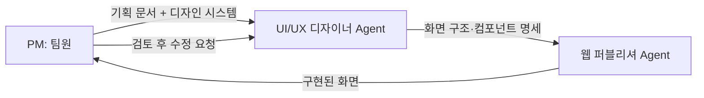
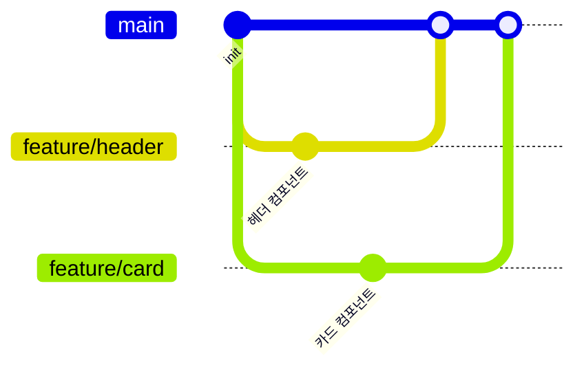

# 캡쳐 정리 노트

2026-09-18 · @다연

## 평가 기준

6개 영역을 봅니다. 점수를 매기지는 않지만, 각 영역을 열면 3단계 기준(미흡 / 충족 / 우수)이 있으니 발표 준비 중 스스로 점검해 보세요.

| 영역 | 무엇을 보는가 |
| --- | --- |
| 기획 | 문제 정의, 타깃 사용자, MVP 범위, 정상 흐름과 예외 흐름 설계, 기획 문서와 결과물의 일치 |
| Agent 설계 | 역할 분리, 지시문의 입력·출력·제약, Agent 간 핸드오프 |
| 디자인 시스템 | 피그마·Claude Design으로 정의한 공용 시스템과 재사용, 컴포넌트 단위 설계, 두 도구 간·디자인-구현 간 일관성 |
| 하네스 설계 | CLAUDE.md·Skills로 고정한 규칙, 반복 작업의 재사용화, 검증·수정 절차 |
| Git·GitHub 협업 | 브랜치 전략, 이슈로 작업 관리, PR 작성·리뷰, 커밋 메시지 품질, 충돌 해결 |
| 협업 효율화·회고 | 역할 분담과 병렬화, Claude 활용 노하우 공유, 시행착오와 개선 사례 |

## 기획

| 단계 | 내용 |
| --- | --- |
| 미흡 | • 타깃 사용자가 "모든 사람", "대학생" 수준으로 넓거나 없다.<br>• 문제 정의 없이 기능 목록만 있다. "왜 만드는가"에 답하지 못한다.<br>• 기획 문서(PRD·유저 스토리·화면 흐름)가 하나도 없거나, 발표용으로 뒤늦게 쓴 것이다.<br>• 기획한 기능과 실제 결과물이 절반 이상 다르지만 이유를 설명하지 못한다.<br>• 정상 흐름만 있고 예외 흐름(입력이 비었을 때, 실패했을 때, 데이터가 없을 때)을 전혀 생각하지 않았다. |
| 충족 | • 타깃 사용자와 핵심 문제가 한 문장으로 정리되어 있다.<br>• MVP 기능이 우선순위 순으로 3\~7개 정리되어 있고, 1순위 기능은 완성되어 있다.<br>• PRD·유저 스토리·화면 흐름 중 2개 이상이 있고, 프로젝트 시작 전에 작성되었음을 커밋 이력으로 확인할 수 있다.<br>• 기획 문서의 화면 흐름과 실제 결과물이 큰 틀에서 일치한다.<br>• 핵심 기능마다 예외 흐름이 1개 이상 정의되어 있고, 사용자가 무엇을 보게 되는지 적혀 있다. |
| 우수 | • 충족 조건을 모두 만족한다.<br>• 처음 기획에서 뺀 기능이 1개 이상 있고, 왜 뺐는지(시간·난이도·우선순위)를 설명한다.<br>• 유저 스토리가 "\~로서 \~하고 싶다, 그래야 \~할 수 있다" 형식으로 쓰여 있고, 각 스토리가 어느 화면·PR에서 구현되었는지 연결된다.<br>• 기획 문서의 문장이 Agent 지시문에 그대로 인용되어, 기획이 실제 작업의 근거로 쓰였음을 보여준다.<br>• 예외 흐름이 표로 정리되어 있고(상황 → 사용자에게 보이는 것 → 다음 행동), 그중 2개 이상이 실제 서비스에서 동작한다.<br>• 빈 상태(데이터 없음)·오류·성공 안내 화면이 디자인 시스템 안에서 일관되게 설계되어 있다. |

## Agent 설계

| 단계 | 내용 |
| --- | --- |
| 미흡 | • Agent가 하나뿐이거나, 여러 개여도 지시문이 "좋은 화면을 만들어줘" 수준이다.<br>• 지시문에 입력·출력·제약 중 2개 이상이 빠져 있다.<br>• Agent 이름만 있고 실제로는 매번 채팅에 즉흥적으로 요청했다.<br>• 지시문 파일이 저장소에 없다. |
| 충족 | • UI/UX 디자이너 Agent와 웹 퍼블리셔 Agent가 분리되어 있고, 지시문 파일이 저장소에 있다.<br>• 각 지시문에 ① 받는 것(입력) ② 내놓는 것(출력 형식) ③ 하지 말 것(제약)이 각각 1줄 이상 명시되어 있다.<br>• 두 Agent의 책임이 겹치지 않는다. 디자이너가 코드를 쓰거나 퍼블리셔가 화면 구조를 바꾸지 않는다.<br>• 앞 Agent의 출력이 뒤 Agent의 입력으로 어떻게 전달되는지 말로 설명할 수 있다. |
| 우수 | • 충족 조건을 모두 만족한다.<br>• Agent 간 흐름이 mermaid 등 그림 한 장으로 정리되어 있고, 되돌아가는 경로(검토 후 수정 요청)까지 표시되어 있다.<br>• 지시문을 2번 이상 수정한 이력이 남아 있고, 각 수정이 어떤 문제 때문이었는지 설명한다.<br>• 같은 입력을 넣었을 때 출력이 일정하게 나오는지 최소 한 번 확인했고, 그 결과를 제시한다. |

## 디자인 시스템

| 단계 | 내용 |
| --- | --- |
| 미흡 | • 피그마나 Claude Design 어느 쪽도 거치지 않고 바로 채팅으로 화면을 요청했다.<br>• 피그마와 Claude Design을 둘 다 썼지만 서로 다른 색·컴포넌트를 정의해 두 벌의 디자인 시스템이 따로 논다.<br>• 화면마다 색·글꼴·버튼 모양이 다르다. 같은 버튼이 3가지 이상 모양으로 존재한다.<br>• 아이콘을 여기저기서 가져와 스타일이 섞여 있다.<br>• 디자인 시스템이라는 이름의 페이지는 있지만 실제 화면 설계에 쓰이지 않았다. |
| 충족 | • 팀 공용 피그마에 색상(Primary·Secondary·Background 등 최소 4개), 타이포(제목·본문 최소 2단계), Lucide 아이콘이 정의되어 있다.<br>• Claude Design에도 같은 색·타이포·아이콘이 디자인 시스템으로 설정되어 있고, 화면 생성 시 그 시스템을 기준으로 만들었다.<br>• 피그마와 Claude Design 중 어느 것을 원본(source of truth)으로 삼았는지, 두 도구를 각각 어느 단계에 썼는지 설명한다.<br>• Button·Card·Header 등 컴포넌트가 최소 5개 분리되어 있고, 컴포넌트마다 상태(기본·hover·disabled 등)가 1개 이상 정의되어 있다.<br>• 모든 화면이 이 컴포넌트를 조합해서 만들어졌다.<br>• 피그마 또는 Claude Design 화면과 실제 결과물을 나란히 놓았을 때 배치·색·글꼴이 대체로 일치한다. |
| 우수 | • 충족 조건을 모두 만족한다.<br>• 피그마·Claude Design·Agent 지시문·코드 네 곳에서 색·컴포넌트 이름이 같은 이름으로 쓰인다.<br>• Claude Design에서 만든 화면을 피그마로 가져오거나, 피그마 시스템을 Claude Design에 넣는 등 두 도구를 오간 흐름을 실제 파일로 보여준다.<br>• 디자인 시스템을 바꿨을 때(예: Primary 색 변경) 화면 전체에 한 번에 반영된 사례를 보여준다.<br>• 모바일·데스크톱 등 최소 2가지 화면 크기를 고려한 설계가 있다. |

## 하네스 설계

| 단계 | 내용 |
| --- | --- |
| 미흡 | • CLAUDE.md가 없거나, 있어도 자동 생성된 기본 내용 그대로다.<br>• 같은 지시(예: "주석은 한글로")를 채팅마다 반복했다.<br>• Claude가 만든 결과를 확인하지 않고 그대로 커밋했다.<br>• 잘못된 결과가 나왔을 때 "다시 해줘"만 반복했다. |
| 충족 | • CLAUDE.md에 ① 코드 컨벤션(주석 한글·이름 영어) ② 폴더 구조 ③ 금지 사항이 각각 명시되어 있다.<br>• 반복 작업 1개 이상이 Skill 또는 재사용 프롬프트 파일로 저장소에 들어 있고, 2번 이상 사용되었다.<br>• 결과물을 확인하는 방법이 있다.<br>• 잘못된 결과를 잡아낸 사례가 1개 이상 있고, 어떻게 고쳤는지 설명한다. |
| 우수 | • 충족 조건을 모두 만족한다.<br>• CLAUDE.md가 프로젝트 진행 중 2번 이상 수정되었고, 각 수정이 어떤 실수를 막기 위한 것인지 설명한다.<br>• Skill이 2개 이상 있고, 팀원 누구나 같은 결과를 얻을 수 있게 사용법이 적혀 있다.<br>• 검증 절차가 문서화되어 있어 Claude가 틀렸을 때 ① 어디서 발견 ② 어느 커밋으로 되돌림 ③ 지시문 어디를 고침이 이력으로 남아 있다. |

## Git·GitHub 협업

| 단계 | 내용 |
| --- | --- |
| 미흡 | • main 브랜치에 직접 커밋했거나, 브랜치를 만들었지만 이름 규칙이 없다.<br>• 이슈가 없거나, 있어도 담당자·라벨 없이 제목만 있다.<br>• PR 없이 병합했거나, PR 본문이 비어 있다.<br>• 커밋 메시지가 "수정", "ㅇㅇ", "final" 수준이다.<br>• 팀원 한두 명의 커밋만 있고 나머지는 이력에 없다. |
| 충족 | • 브랜치 전략(예: main + feature/)이 README에 적혀 있고, 이름 규칙을 실제 브랜치가 따른다.<br>• 할 일이 이슈로 등록되어 있고, 이슈마다 담당자와 라벨(feature·bug·design 등)이 있다.<br>• 모든 병합이 PR을 거쳤고, PR 본문에 작업 내용과 closes #이슈번호가 있다.<br>• 커밋 메시지에서 무엇을 바꿨는지 읽을 수 있다.<br>• 팀원 전원의 커밋과 PR이 이력에 있다. |
| 우수 | • 충족 조건을 모두 만족한다.<br>• 이슈 템플릿과 PR 템플릿이 .github/ 폴더에 있고 실제로 쓰였다.<br>• PR마다 다른 팀원의 리뷰 코멘트가 1개 이상 있고, 코멘트를 반영해 수정한 뒤 병합했다.<br>• 충돌이 발생한 사례가 1개 이상 있고, 어느 파일에서 왜 생겼고 어떻게 해결했는지 설명한다.<br>• 확인 항목 요약: ① 브랜치 전략과 이름 규칙 ② 이슈 등록·담당자·라벨 ③ 이슈–PR 연결 ④ PR 설명·리뷰·병합 규칙 ⑤ 커밋 메시지 ⑥ 충돌 해결 |

## 협업 효율화·회고

| 단계 | 내용 |
| --- | --- |
| 미흡 | • 역할 분담이 없거나 "다 같이 했다"로 끝난다.<br>• 한 사람이 Claude에게 모두 시키고 나머지는 지켜봤다.<br>• 회고가 "재미있었다", "힘들었다" 수준이며 구체적 사례가 없다.<br>• 실패 사례를 말하지 않거나 "없었다"고 답한다. |
| 충족 | • 팀원별 담당 영역이 표로 정리되어 있고, 각자 담당한 이슈·PR과 연결된다.<br>• 서로 겹치지 않게 작업을 나눈 방법을 설명한다.<br>• 잘 된 점과 안 된 점을 각각 구체적 사례 1개 이상으로 든다.<br>• 실패 사례 1개 이상에 대해 원인과 고친 방법을 설명한다. |
| 우수 | • 충족 조건을 모두 만족한다.<br>• 팀 안에서 Claude 활용 노하우(잘 먹히는 지시문, 확인 체크리스트 등)를 문서나 템플릿으로 만들어 공유했고, 그 파일이 저장소에 있다.<br>• 프로젝트 중간에 진행 방식을 바꾼 결정이 1개 이상 있고, 바꾼 전후 차이를 설명한다.<br>• "다음에는 이렇게 하겠다"가 "더 열심히"가 아니라 실행 가능한 행동으로 적혀 있다.<br>• 팀원 각자의 회고가 기술 블로그에 STAR 형식으로 올라가 있다. |

## 발표 목차

7개 순서로 발표합니다. 각 순서가 평가 영역 하나와 대응하므로, 이 순서대로 준비하면 빠뜨리는 항목이 없습니다. 발표 시간은 팀당 **20분**입니다. 20분을 넘기지 않도록 리허설하세요.

| 순서 | 항목 | 내용 | 관련 영역 |
| --- | --- | --- | --- |
| 1 | 프로젝트 소개 | 누구의 어떤 문제를 푸는지 한 문장 → MVP 기능 목록과 우선순위 → 뺀 기능과 이유 → 정상 흐름과 예외 흐름 | 기획 |
| 2 | 디자인 시스템 | 피그마·Claude Design 화면 캡처, 색·타이포·아이콘 정의, 컴포넌트 목록, 두 도구를 쓴 순서와 역할, 디자인과 구현 결과 나란히 비교 | 디자인 시스템 |
| 3 | Agent 구성도 | 역할별 Agent와 책임, 지시문 핵심 발췌(입력·출력·제약), Agent 간 흐름도 | Agent 설계 |
| 4 | 프로젝트 규칙 | CLAUDE.md 핵심 내용, 만들어 둔 Skill, 잘못된 결과를 잡아낸 검증 방법과 실제 사례 | 하네스 설계 |
| 5 | 협업 방식 | 브랜치 전략 그림, 이슈 보드 캡처, 이슈–PR 연결과 리뷰 화면, 팀원별 역할 분담표, 병렬로 작업한 방법 | Git·GitHub / 효율화 |
| 6 | 데모 | 완성한 서비스를 실제로 실행해 시연 | 전 영역 종합 |
| 7 | 회고 | 실패 사례 1개 이상, 개선한 점, 다음 프로젝트에서 다르게 할 것 | 협업 효율화·회고 |

## README.md로 발표 자료 만들기

발표 자료는 별도 PPT가 아니라 GitHub 저장소의 `README.md`로 만듭니다. 저장소 첫 화면에 그대로 보이므로, 발표 당일에는 이 페이지를 열어 위에서 아래로 내려가며 설명하면 됩니다.

### 작성 순서

1. 저장소 최상위(루트) 폴더에 `README.md` 파일을 만듭니다. 이름은 대문자 `README`, 확장자는 `.md`여야 GitHub가 첫 화면에 자동으로 보여줍니다.
2. 아래 템플릿을 복사해 붙여넣고, `< >`로 표시된 부분을 팀 내용으로 채웁니다.
3. 이미지(피그마·Claude Design 캡처, PR 화면)는 저장소에 `docs/images/` 폴더를 만들어 넣고, ``으로 연결합니다.
4. Agent 흐름도와 브랜치 전략은 `mermaid` 코드 블록으로 그리면 GitHub가 그림으로 그려 줍니다. 템플릿에 예시가 들어 있습니다.
5. 작성 후 브랜치를 만들어 PR로 올리고, 팀원 한 명이 리뷰한 뒤 main에 합칩니다. README 작성 자체도 협업 평가 대상입니다.
6. GitHub에서 README를 열어 이미지가 깨지지 않는지, mermaid가 그림으로 나오는지 확인합니다.

> Claude에게 README 초안을 맡겨도 됩니다. 단, 회고와 실패 사례는 반드시 팀원이 직접 씁니다. 발표에서 질문이 나왔을 때 자기 말로 답할 수 있어야 하기 때문입니다.

### README 템플릿

````markdown
# <프로젝트 이름>

> <누구의 어떤 문제를 어떻게 푸는지, 한 문장>

| 항목 | 내용 |
|---|---|
| 팀명 | <팀명> |
| 팀원 | <이름(역할)>, <이름(역할)>, <이름(역할)> |
| 기간 | 2026.MM.DD ~ 2026.MM.DD |
| 배포 링크 | <URL 또는 "없음"> |
| 피그마 | <URL> |
| Claude Design | <URL 또는 캡처 폴더> |

---

## 1. 프로젝트 소개

### 문제 정의
- 타깃 사용자: <누구>
- 겪는 문제: <무엇>
- 우리의 해결: <어떻게>

### MVP 기능
| 우선순위 | 기능 | 상태 |
|---|---|---|
| 1 | <핵심 기능> | 완료 |
| 2 | <기능> | 완료 |
| 3 | <기능> | 일부 |

### 범위에서 제외한 것
- <뺀 기능> — 이유: <왜>

### 정상 흐름
<사용자가 서비스를 처음 열어 목표를 달성하기까지의 순서>
1. <화면 A> → 2. <화면 B> → 3. <완료>

### 예외 흐름
| 상황 | 사용자에게 보이는 것 | 다음 행동 | 구현 여부 |
|---|---|---|---|
| 필수 입력이 비어 있음 | <안내 문구·버튼 비활성화> | <입력 후 재시도> | ✅ |
| 데이터가 하나도 없음(빈 상태) | <빈 화면 안내와 첫 행동 유도> | <추가하기> | ✅ |
| 저장·불러오기 실패 | <오류 문구> | <다시 시도> | 미구현 |
| <추가 상황> | | | |

### 기획 문서
- [PRD](docs/prd.md) · [유저 스토리](docs/user-stories.md) · [화면 흐름](docs/flow.md)

---

## 2. 디자인 시스템


### 사용 도구와 역할
| 도구 | 어느 단계에 썼나 | 원본 여부 |
|---|---|---|
| 피그마 | <예: 색·타이포·컴포넌트 정의> | <원본 / 참고> |
| Claude Design | <예: 시스템 기반 화면 생성·변형> | <원본 / 참고> |

### 정의
| 구분 | 정의 | 피그마 | Claude Design |
|---|---|---|---|
| 색상 | Primary <#hex>, Secondary <#hex>, Background <#hex> | ✅ | ✅ |
| 타이포 | 제목 <글꼴/크기>, 본문 <글꼴/크기> | ✅ | ✅ |
| 아이콘 | Lucide | ✅ | ✅ |

### 컴포넌트 목록
- Button (primary / secondary / disabled)
- Card
- Header
- <추가 컴포넌트>

### 디자인 vs 구현
| 피그마 | Claude Design | 실제 화면 |
|---|---|---|
|  |  |  |

---

## 3. Agent 구성



### 역할별 Agent
| Agent | 역할 | 입력 | 출력 | 제약 |
|---|---|---|---|---|
| UI/UX 디자이너 | <책임> | <받는 것> | <내놓는 것> | <하지 말 것> |
| 웹 퍼블리셔 | <책임> | <받는 것> | <내놓는 것> | <하지 말 것> |

### 지시문 핵심 발췌
```
<가장 효과가 컸던 지시문 5~10줄>
```

### 지시문 수정 이력
- v1 → v2: <무엇을 왜 바꿨나>

---

## 4. 프로젝트 규칙 (하네스)

### CLAUDE.md 핵심
- 코드 컨벤션: 주석은 한글, 변수·함수명은 영어
- 폴더 구조: <요약>
- 금지 사항: <예: 디자인 시스템에 없는 색 사용 금지>

### 만들어 둔 Skill / 재사용 프롬프트
| 이름 | 하는 일 | 사용 횟수 |
|---|---|---|
| <skill 이름> | <설명> | <N>회 |

### 검증 절차
1. <결과물을 무엇으로 확인했나>
2. <틀렸을 때 어떻게 되돌렸나>

**실제 사례**: <Claude가 잘못 만든 것 → 어떻게 발견 → 어떻게 수정>

---

## 5. 협업 방식

### 브랜치 전략


- 브랜치 종류: `main`(배포용) / `feature/<기능명>`(기능 개발) / <필요 시 추가>
- 브랜치 이름 규칙: `feature/<이슈번호>-<기능명>` (예: `feature/12-header`)
- 합치기 규칙: PR 생성 → 팀원 1명 리뷰 → main 병합 → 브랜치 삭제

### 이슈 활용
| 이슈 | 담당 | 라벨 | 연결 PR | 상태 |
|---|---|---|---|---|
| #<번호> <제목> | <이름> | <feature / bug / design> | #<번호> | 완료 |

- 이슈 템플릿 사용 여부: <예 / 아니오> → `.github/ISSUE_TEMPLATE/`


### PR 활용
- PR 템플릿: `.github/PULL_REQUEST_TEMPLATE.md` (<있음 / 없음>)
- PR 본문 필수 항목: 작업 내용 / 스크린샷 / `closes #이슈번호`
- 리뷰 규칙: <누가, 무엇을 확인하고 승인하는가>
- 총 PR 수: <N>개, 리뷰 코멘트가 오간 PR: <N>개

### 역할 분담
| 팀원 | 담당 영역 | 담당 이슈 | 주요 PR |
|---|---|---|---|
| <이름> | <영역> | #<번호>, #<번호> | #<번호> |

### 병렬 작업 방법
- <서로 겹치지 않게 어떻게 나눴나>

### 충돌 해결 사례
- <언제, 어디서, 어떻게 해결했나>


---

## 6. 데모

- 실행 방법: <배포 링크 또는 로컬 실행 방법>
- 시연 순서: <서비스를 어떤 흐름으로 보여줄지>

---

## 7. 회고

### 잘 된 점
- <구체적 사례>

### 실패 사례와 개선
| 무엇이 실패했나 | 왜 | 어떻게 고쳤나 |
|---|---|---|
| <사례> | <원인> | <개선> |

### 팀 안에서 공유한 Claude 활용 노하우
- <템플릿·문서·규칙>

### 다음 프로젝트에서 다르게 할 것
1. <실행 가능한 수준으로>
2. <...>
````
