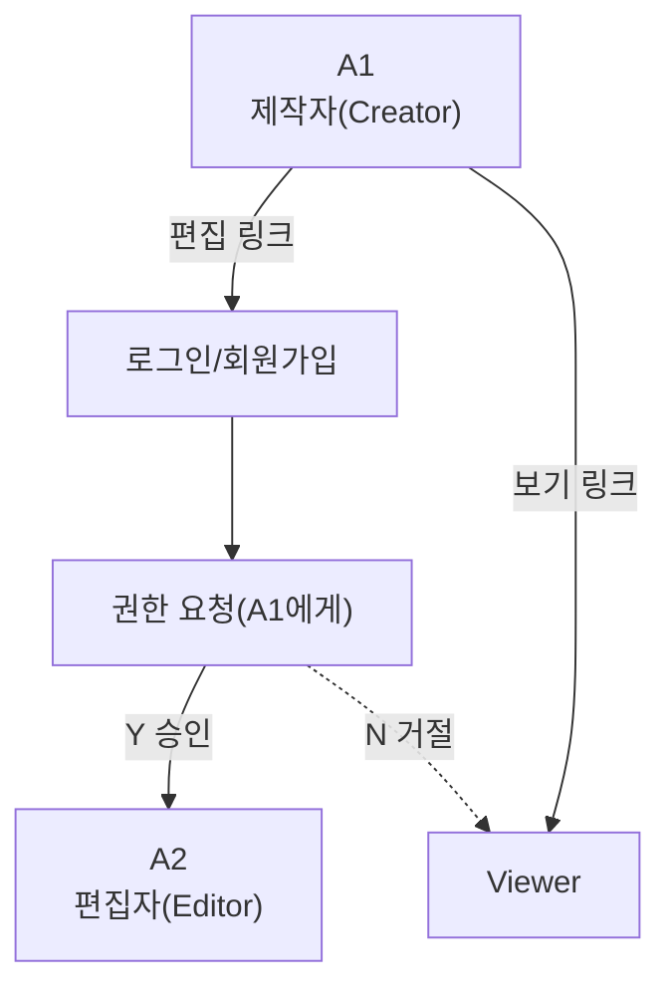

# 할 일 목록 (시작 기능 구현)

## 1. 기획
- 문제 정의 / 타깃 / 핵심 기능 정리
- MVP 기능 확정
- 사용자 역할 지정 (확정)
  - → A1 / A2 / Viewer / S-viewer
- 역할별 권한 정리
- 공유 링크 흐름 정리 (편집 / 보기)
- 편집 권한 요청 → 제작자 승인/거절 흐름 정리
- 일정 종료 후 처리 방식 정리
- 변경 사항 실시간 동기화 방식 정리
- AI 일정 생성 기능 기획
- AI 일정 생성 시 사용할 선택 조건 정의
    - 일
    - 여행 스타일
    - 관심장소 
    - 동행
    - 이동방식
- AI 추천 일정 -> Route Planner 연결 흐름 정리

## 2. 화면 구현
- 기본 페이지
  - main (home)
  - Login screen
  - Sign up screen
  - Explore Destinations
  - community
  - My routes (+ AI)
  - Route planner app
- Route planner app 역할별 화면
  - Creator 화면
  - Editor 화면
  - Viewer 화면
  - S-viewer 화면
- AI 일정 생성 화면
    - 일정 선택
    - 여행 스타일 선택
    - 관심 장소 선택
    - 동행 선택 
    - 이동 방식 선택
    - AI 추천 일정 확인 화면
    - 추천 일정 다시 생성
    - '이 일정으로 시작하기' -> Route Planner App으로 연결

## 3. 공유/권한 관련 UI 만들기
- **Creator (A1)**
  - 일정 공유
  - 편집가능·보기전용 링크 생성
  - 편집 권한 요청 알림 (→ 요청자 닉네임, 일정명, 요청 시간 등)
  - 승인·거절 버튼
  - 권한 관리 화면
- **Editor (A2)**
  - 편집 링크 접속
  - 로그인·회원가입
  - 편집 권한 요청 / 승인 → Editor 등록
- **Viewer**
  - 보기 전용 일정 화면
  - '내 일정에 추가' 버튼
  - 편집 기능 없애기 / 로그인 안했으면 Login으로 이동
- **Saved-Viewer**
  - 로그인 후 일정 저장
  - 편집 기능 제거
  - '내 일정에서 제거' 가능 (제거해도 원본 일정에 영향 X)
  - ⇒ 모든 role → 원본 일정 변경사항 동기화

## 4. Route Planner 기능 마무리
- 장소 (검색)·추가·삭제 / 순서 변경
- 지도와 방문지 동기화
- 최단 거리·시간
- 장소별 이동수단
- 대중교통 상세 경로
- 영업 상태 표시
- 활동 로그 (계획 저장됨)
- 변수/상황 변경 → 동선 재계산
- Toast 알림(팝업)
- 반응형 / 모바일 화면 확인 (*)
- 다크모드 확인
- AI 생성 장소 / 방문순서 / 이동수단 / 이동시간을 Route Planner에 반영
- AI 생성 일정도 기존 Route Planner에서 수정 가능하도록 연결
## 5. 페이지 연결 정리
- main → 생성 → my routes → 날짜 → Route Planner App

## 6. 실제 기능 연결
- → Supabase? (DB 만들기..?)
- 일정 DB 만들기
- 일정 참여자 / 역할 DB 만들기
- 권한 요청 DB 만들기
- 내 일정 저장 관계 만들기
- AI 일정 생성 API 연결
- AI 생성 일정과 기존 일정 DB 연결

## 7. 실제 권한 적용
- Creator → 권한 관리 / 원본 일정 삭제
- Editor → 편집 (일정 내용 수정 가능)
- Viewer → 수정 X
  - (Saved-Viewer: 내 일정 제거만 가능)
- → Front 버튼 숨기기뿐만 아니라 DB에서도 권한 제한

## 8. 실제 공유 기능
- 보기 전용 / 편집 전용 링크 생성
- 링크 접속 시 일정 확인
- 로그인 / 회원가입 연결
- Creator (A1)에게 알림
- 승인 / 거절 (승인 → A2 / 거절 → Viewer)

## 9. 실시간 동기화
- A1/A2 수정 → DB 변경 → 반영 → Viewer도 변경 사항 즉시 확인
- AI 생성 일정도 동일한 실시간 동기화 적용
- AI 생성 일정도 동일한 실시간 동기화 적용

## 10. 테스트
- Creator 계정 / Editor 계정으로 Test
- Viewer 상태로 Test
- Saved-Viewer(로그인을 진행하고 내 일정에 일정을 추가한 사람)로 Test
- 편집 권한 요청 → 승인/거절 Test
- 일정 삭제 (A1 / Saved-viewer 등) Test
- 동기화 (실시간 변경) 테스트
- 모바일 테스트 / 오류·예외 상황 Test
- AI 일정 생성 -> Route Planner 연결 테스트
- AI 생성 실패 /  결과 없음 / API 오류 상황 Test

## 11. 회원가입 / 인증
- 이메일 인증번호 발송
- 이메일 인증번호 확인 
- 인증번호 재전송 / 만료 처리
- 비밀번호 / 비밀번호 확인
- 닉네임 입력
- 필수 약관 동의 
- 이메일 일증 완료 후 회원가입 가능
- 실제 이메일 인증 기능 연결
- 회원가입 / 로그인 연결

## 역할 흐름 (초안)

- **편집 링크**로 들어온 사용자: 로그인/회원가입 → A1에게 권한 요청 → **승인(Y)** 시 A2(편집자)로 등록, **거절(N)** 시 Viewer로 전환
- **보기 링크**로 들어온 사용자: 별도 절차 없이 바로 Viewer